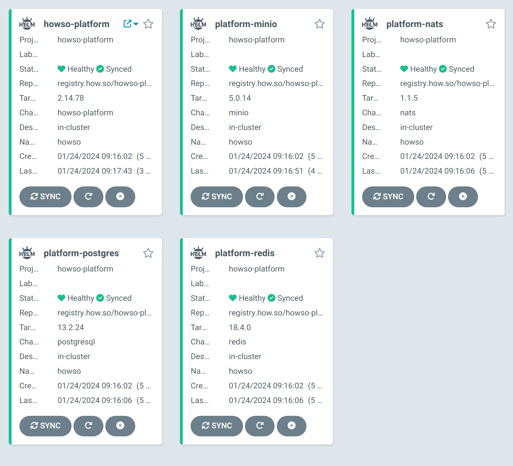

# Installation Example: ArgoCD Installation for Howso Platform

## Overview

This guide demonstrates deploying the Howso Platform using ArgoCD, a GitOps tool for Kubernetes. It emphasizes the use of ArgoCD's Helm chart capabilities to deploy the Howso Platform along with its dependent charts.

This documentation covers basic ArgoCD usage for deploying the Howso Platform. It is not a comprehensive guide to all ArgoCD features.

Ensure you have completed the [prerequisites](../prereqs/README.md) before proceeding, and have a Kubernetes cluster running, with a howso namespace, and the argocd cli installed. 

```sh
# prerequisites TLDR
# install argocd cli https://argo-cd.readthedocs.io/en/stable/cli_installation/
# helm registry login registry.how.so --username your_email@example.com --password your_license_id 
# add local.howso.com pypi|api|www|management|argocd.local.howso.com to /etc/hosts 
k3d cluster create --config prereqs/k3d-single-node.yaml
kubectl create namespace howso
```

## Steps

### Install ArgoCD

To get a basic deployment of ArgoCD, run the following commands:

```sh
# https://github.com/argoproj/argo-cd/releases/latest
kubectl apply -k argocd-basic/manifests/argocd/
```

> Note: Since detailed ArgoCD installation instructions are beyond the scope of these examples - the above kustomize installation wraps up an ArgoCD installation and the configuration to use the traeffik ingress that is part of the k3d cluster. 

Make sure the ArgoCD server is running before proceeding.  
```sh
watch kubectl get po -A
```

### Login to the argocd

From a terminal with the argocd cli installed - the below instructions will get the initial pw and login.  The cli will be used to add a repo - and monitor the app deployments.

```sh
initial_argocd_pw=$(kubectl -n argocd get secret argocd-initial-admin-secret -o jsonpath="{.data.password}" | base64 -d)
argocd --insecure --grpc-web login argocd.local.howso.com  --username admin --password $initial_argocd_pw
echo "Log into argocd at https://argocd.local.howso.com with username admin and password $initial_argocd_pw"
```
> Note: Argocd ingress can be tricky to get working.  If you have trouble, you can port-forward to the argocd server (`kubectl -n argocd port-forward svc/argocd-server 8080:80`) and use http://localhost:8080.

### Apply the CRD

Argocd uses projects to limit access to Kubernetes resources.  The Howso Platform uses a CRD, a cluster level component.  Installing this seperately, allows the rest of the components to be installed in a project with only namespace-level permissions. 

To extract and apply the CRD directly, use the following command.
```sh
helm template oci://registry.how.so/howso-platform/stable/howso-platform --show-only templates/crds/trainee-crd.yaml | kubectl apply -f -
```


### Add the Chart registry to ArgoCD
See the [prerequisites](../prereqs/README.md#accessing-the-howso-platform-helm-registry) for information on how to get the credentials to access the Howso Platform Helm registry.

> Note: The helm registry is of type oci - so the command to add it includes the `--enable-oci` flag.

```sh
argocd repo add registry.how.so --type helm --name replicated --username youremail@example.com --password <your-license-id> --enable-oci
```

### Create datastore secrets

See the explanation in [basic installation](../helm-basic/README.md#create-datastore-secrets) for more details.

```sh
# Minio
kubectl create secret generic platform-minio --from-literal=rootPassword="$(openssl rand -base64 20)" --from-literal=rootUser="$(openssl rand -base64 20)" --dry-run=client -o yaml | kubectl -n howso apply -f -
# Postgres
kubectl create secret generic platform-postgres-postgresql --from-literal=postgres-password="$(openssl rand -base64 20)" --dry-run=client -o yaml | kubectl -n howso apply -f -
# Redis
kubectl create secret generic platform-redis --from-literal=redis-password="$(openssl rand -base64 20)" --dry-run=client -o yaml | kubectl -n howso apply -f -
```


### Install Argocd Project and Application

If you open up the [project manifest](manifests/argocd-project.yaml), you will see that it is configured to use the `howso` namespace.  Since the CRD was installed seperately, and the Howso Platform [application manifest](manifests/argocd-howso-platform-app.yaml) is configured to skip them, the project does not need to give any cluster level permissions.

Also note in the [app manifests](manifests/argocd-required-apps.yaml), the information previously in values files (in direct helm installs), is embedded in to the manifests.  

```sh
kubectl apply -f argocd-basic/manifests/argocd-project.yaml
kubectl apply -f argocd-basic/manifests/argocd-requirement-apps.yaml
kubectl apply -f argocd-basic/manifests/argocd-howso-platform-app.yaml
```

Check via the UI - or the CLI, that the ArgoCD project and application are created and healthy.

```sh
argocd app list
```


