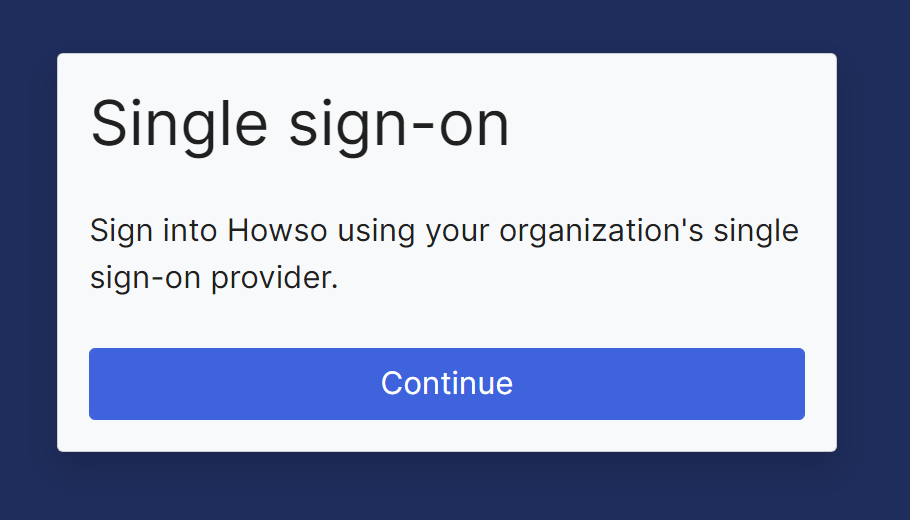
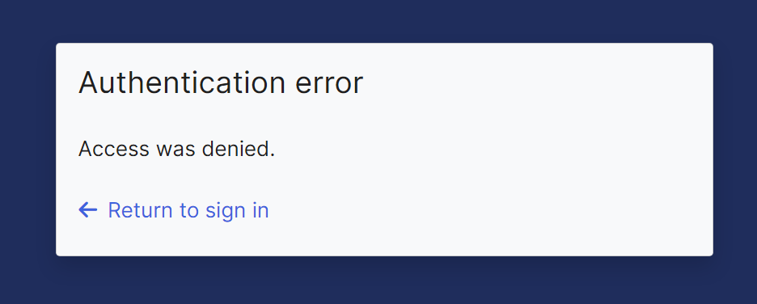
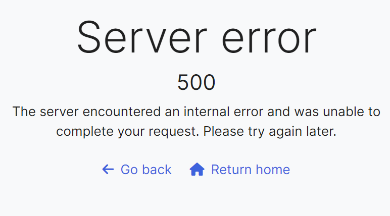

# SSO Troubleshooting for Howso Platform

This guide provides steps for troubleshooting Single Sign-On (SSO) issues with the Howso Platform. 

## Overview 

When set up to use SSO with an external Identity Provider (IdP), Howso Platform uses the Authorization Code Flow with OpenID Connect (OIDC) for user authentication and authorization, optionally implementing Proof Key for Code Exchange (PKCE).

The Howso Platform configuration is under the `oidc` section in the Helm values.  Additional configuration is required within the IdP, to create an OAuth application that Howso Platform can use to authenticate users.

> Note: The Howso Platform User Management Service is itself an IdP and Authorization server, where other internal Howso Platform services are configured as applications.  This is a separate topic, but can cause confusion, as, for instance, there will also be authorize calls to the UMS observable in the browser network tab.

Once the application is created within the IdP, and the Helm values are applied, unauthenticated users navigating to Howso Platform domains should see the following sign-on button.



Clicking will kick off the authentication flow.  Understanding the main steps of the flow can help with troubleshooting:
- User navigates to Howso Platform and clicks the continue button to sign-on.
- Howso Platform redirects the user's browser to the `authorizeEndpoint` specified in the OIDC configuration.  This should bring up the IdP login page. 
- Once the user has authenticated, the IdP redirects the user back to the [callback](#callback-url-issues) URL in the Howso Platform with an authorization code.  This callback URL is sent to the IdP in the original redirect, but is also part of the configuration supplied to the IdP when the OAuth application is created.  The IdP will check that the redirect URL in the query string and the application configuration match. 
- If the authentication was successful, the redirect back to Howso Platform will include the authorization code.  Alternatively error information will be included in the query string.
- On success, the User Management Service component of Howso Platform will exchange this code for an access token and id token using the `tokenEndpoint`.
- The access token and id token are validated against the public key provided by the IdP at the `jwksEndpoint`.
- The User Management Service will then use the `userinfoEndpoint` (and access token) to get information about the user, such as email address and groups.


## Configuration Verification

Ensure all OIDC configuration items are correctly set in your Howso Platform Helm values:

```yaml
oidc:
  enabled: true
  clientID: "<your-client-id>"
  clientSecret: "<your-client-secret>"
  algorithm: "RS256"
  jwksEndpoint: "<jwks-endpoint-url>"
  authorizeEndpoint: "<authorize-endpoint-url>"
  tokenEndpoint: "<token-endpoint-url>"
  userinfoEndpoint: "<userinfo-endpoint-url>"
  scopes: "openid email profile" 
  # PKCE Configuration (added Howso Platform 2024.7.1+)
  usePKCE: true
  pkceCodeChallengeMethod: "S256"
  pkceCodeVerifierSize: 64
```

Verify that these values match your IdP's configuration exactly.


## Browser Checks

- Before attempting a login, ensure that you can access all subdomains of Howso Platform without certificate warnings. 
- Clear your browser cache, or use an incognito window to avoid caching issues.

## Network Checks

The `authorizeEndpoint` needs to be accessible from the workstation of the user's Browser.  The `tokenEndpoint`, `userinfoEndpoint`, and `jwksEndpoint` need to be accessible from the Howso Platform User Management Service (UMS).

To test the accessibility from the UMS, you can use `curl` from the Howso Platform UMS pod:

```bash
kubectl exec -n howso -it \
             $(kubectl get pod -n howso -l app.kubernetes.io/component=user-management-service -o jsonpath='{.items[0].metadata.name}') \
             -- curl -v <jwks-endpoint-url>
```

> Note: The `jwksEndpoint` should return a JSON document with a `keys` key containing an array of public keys.  Testing other endpoints will likely return errors, but as long as they are returned from the IdP (and don't hang), that is fine, we're just testing for accessibility.


## Troubleshooting tools

The key tools for troubleshooting OIDC issues are the Browser Developer Tools and access to the UMS logs.

### Browser Developer Tools

Much of the OIDC flow happens in the browser.  Using the browser's developer tools can often reveal information that is otherwise not displayed.

Each browser is different, consult the documentation for how to bring up the developer tools.  Open and navigate to the Network tab.  This will show all the requests made by the browser.  It is often useful to navigate to the initial login screen, and press the clear button before starting the login.

#### Using the Tools to Debug

Upon logging in - look for the request to the `authorizeEndpoint` (note, make sure to distinguish between calls to the IdP authorize endpoint, and internal Howso Platform UMS authorize calls) and check the response.  The browser should redirect to the IdP login page.  If the user has an existing session with the IdP, it may immediately redirect back to Howso Platform.  The response should have a status code of 302, and the location header should be the /oidc/callback/ URL off the Howso Platform.  Look at the query string of the location header, errors during the authentication process will be included there.

After logging in, look for a /oidc/callback request to the Howso Platform.

### Check the User Management Service Logs

```sh
kubectl logs -n howso -l app.kubernetes.io/component=user-management-service
```

Not usually required, but you can increase the verbosity of the logs by setting the `ums.logLevel` in the Howso Platform Helm values to 15, 10 or 5. 

```yaml
ums:
  logLevel: 15
```

## Debugging the SSO Flow

With the [debug tools](#troubleshooting-tools) ready, and basic [configuration](#configuration-verification) checked, initiate a login.  Typically failures will occur as either an [IdP Error page](#idp-error-messages), or an [Authentication Error](#authentication-errors), or [Server 500 Error](#server-500-errors) back at the Howso Platform.

### IdP Error Messages
This section covers issues that occurs with the initial authorization request and do not try and redirect back to the Howso Platform.

Here you may hit issues with your users credentials in the IdP.

Additionally.

#### Client ID is Invalid

An invalid client ID will ofter result in a 400 error in the IdP straight after clicking login.  The IdP may show helpful information, but may not.  You can also check any logs collected on the IdP side.

#### Callback URL Issues

Ensure the callback URL in IdP matches exactly: `https://<ums.subdomain>.<domain>/oidc/callback/`

Note the `/oidc/callback/` path and trailing slash. A mismatching callback URL will typically result in an error within the IdP, straight after the redirect to the `authorizeEndpoint`.


### Authentication Errors

These errors will be seen on return from the IdP to the Howso Platform.



Use the [Browser Developer Tools](#browser-developer-tools) to examine the query string of the redirect URL to get more information.  Look for the `error` and `error_description` parameters.

This is usually not directly an issue with the user having a valid account with the IdP, those issues will be shown on the IdP login page.  

Check for the following:-
- The User does not have permissions to the Howso Platform application in the IdP.
- [PKCE](#proof-key-for-code-exchange-pkce) is required but not configured in Howso Platform.
- The User is locked out.
- The User is not in the correct group.
- The Group is not assigned correctly to the Howso Platform application in the IdP.
- No scopes are requested.
- Invalid scopes are requested.
- [Browser caching issues](#no-matching-state-found-in-storage)

#### Proof Key for Code Exchange (PKCE)

PKCE adds an extra security element to the Authorization Code flow.  For Howso Platform 2024.7.1+:

```yaml
oidc:
  usePKCE: true
  pkceCodeChallengeMethod: "S256"
  pkceCodeVerifierSize: 64
```

#### No Matching State Found in Storage

If you see this error on redirect, try refreshing the page, or using an Incognito Browser whilst troubleshooting.  It is caused by a mismatch between the authorization request and the callback request (which exchange a state value, to make sure they are from the same flow), but is typically due to caching issues when trying multiple logins.


### Server 500 Errors

These errors are typically after a successful IdP login, and redirect, but the Howso Platform server side processing of the rest of the flow fails. 



Look at the [UMS Logs](#check-the-user-management-service-logs) to narrow down the issue. 

Common issues include:-

#### Client Secret is invalid
Expect to see an error like this in the UMS logs, IdP dependent. 
```sh
 Get Token Error (url: https://myidp.example.com/oauth2/default/v1/token, status: 401, body: {"error":"invalid_client","error_description":"The client secret supplied for a confidential client is invalid."})
 ```

#### Incorrect Userinfo/JWKS/Token Endpoints

In the UMS logs, look for errors, such as this:-
```sh
400 Client Error: Bad Request for url: https://myidp.example.com/oauth2/wrong/v1/userinfo
```
Indicating issues with the endpoints in the OIDC configuration.

#### Scope issues

Scopes are the permissions that the Howso Platform is requesting from the IdP.  Typically the default scopes should not need to be altered.

Empty or incorrect scopes will likely show up during the IdP authorization, and appear as [Authentication Errors](#authentication-errors).  However, if your IdP requires extra scopes from the default `openid profile email`, those may appear as server errors, as they result in issues when calling the `userinfoEndpoint` or the `tokenEndpoint`.

These issues may not be in the actual call to the endpoint, but in the processing of the response.  So look for errors in the [UMS Logs](#check-the-user-management-service-logs) that might help indicate what is wrong. 
```sh
  File "/opt/venv/lib/python3.11/site-packages/mozilla_django_oidc/auth.py", line 117, in get_username
    return username_algo(claims.get("email"))
           ^^^^^^^^^^^^^^^^^^^^^^^^^^^^^^^^^^
  File "/app/usersvc/authentication/backends/oidc.py", line 44, in generate_username
    return unicodedata.normalize('NFKC', email)[:150]
           ^^^^^^^^^^^^^^^^^^^^^^^^^^^^^^^^^^^^
```